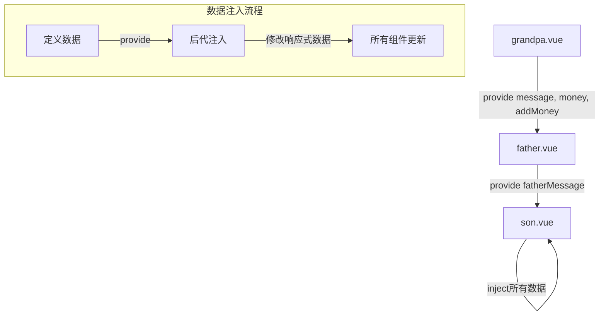

## inject、provide实现跨组件传递

### 关键特性

1. **爷爷组件(提供者)**
   - 使用`provide`函数提供数据
   - 提供了响应式数据（使用`ref`）
   - 提供了方法给后代组件调用

2. **父亲组件(中间层)**
   - 使用`inject`注入爷爷提供的数据
   - 同时使用`provide`向下提供自己的数据
   - 充当了数据传递的中间层

3. **儿子组件(最终消费者)**
   - 使用`inject`注入所有祖先组件的数据
   - 可以直接使用和修改注入的数据

### 特点和优势

1. **避免了"属性透传"问题**：不需要通过每一层组件的props传递数据
2. **响应式数据**：当提供的数据变化时，所有注入该数据的组件都会自动更新
3. **跨组件方法调用**：可以在任何后代组件中调用祖先组件提供的方法，同级组件之间不能直接通过inject/provide进行通信。provide提供的数据只能向下传递给后代组件，而不能水平传递给兄弟组件。

### 使用场景
这种通信方式比Vuex或Pinia等状态管理工具要轻量级，对于中小型应用或特定功能模块的组件通信非常适合。

